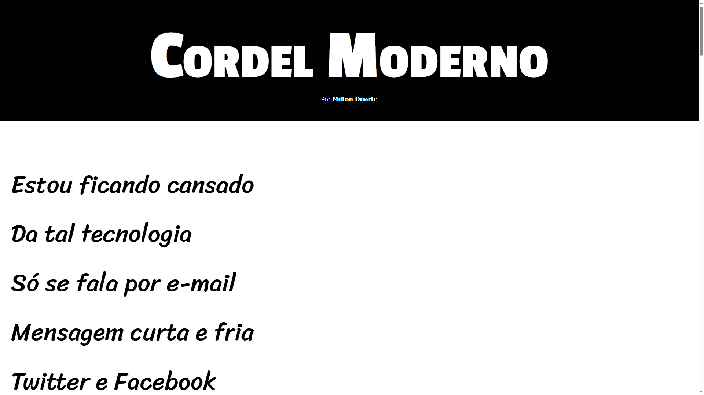

# Projeto Cordel

Projeto do terceiro módulo do curso de HTML e CSS do [Gustavo Guanabara](https://github.com/gustavoguanabara) do canal [Curso em vídeo](https://www.youtube.com/c/CursoemV%C3%ADdeo). Um projeto um pouco mais complexo que o primeiro, possui algumas técnicas um pouco mais avançadas como o parallax. O site é um cordel de Milton duarte.

Para visualizar o projeto com mais detalhes acesse o link abaixo:

[https://lucasluz001.github.io/projeto-cordel/index.html](https://lucasluz001.github.io/projeto-cordel/index.html)

Se quiser assistir as aulas do curso no qual eu me baseei para desenvolver este site, acesse o link:

[https://www.youtube.com/watch?v=Ejkb_YpuHWs&list=PLHz_AreHm4dkZ9-atkcmcBaMZdmLHft8n](https://www.youtube.com/watch?v=Ejkb_YpuHWs&list=PLHz_AreHm4dkZ9-atkcmcBaMZdmLHft8n)